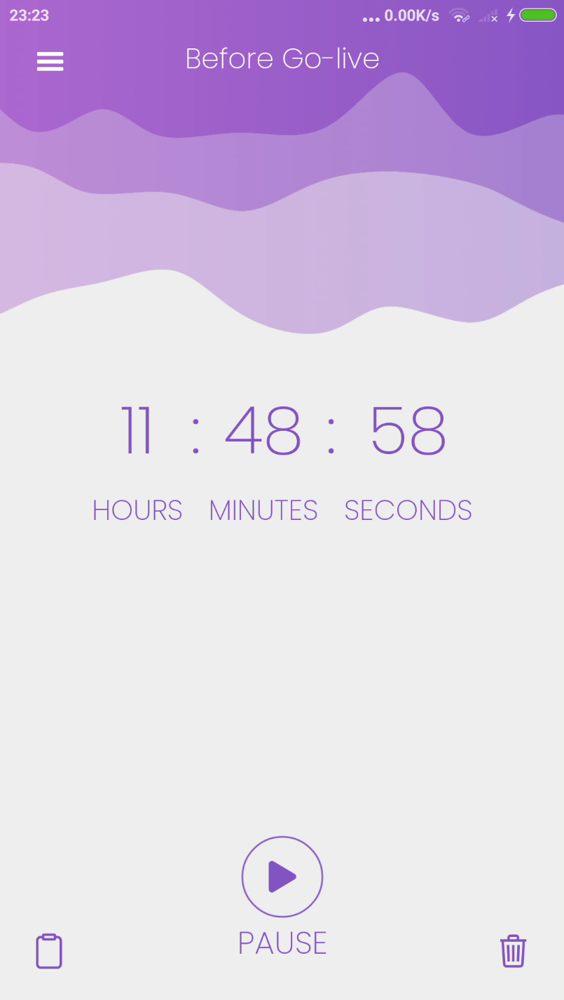

# Countdown App
Countdown App is a mobile application built with Expo React Native that allows users to set a countdown timer for an event. 

This repository contains the source code for the app.

## Preview
[](screenshot.png)

# Installation
Before you begin, ensure that you have the following installed on your machine:

- Node.js
- Expo CLI

To get started, clone this repository and navigate to the project directory:


```$ git clone https://github.com/M-Julius/Countdown-App.git```

```$ cd Countdown-App```

Install the dependencies:

```$ yarn install```

Usage
To run the app, use the Expo CLI:

```$ expo start```

This will start the development server and open the Expo developer tools in your browser. 

and if you want use react native, run this

```$ npx react-native run-android```

build apk?

```$ cd android && ./gradlew assembleRelease```


# Demo
A dummy APK demo of the Countdown App can be found [here](https://drive.google.com/file/d/1SuJ5A6uy6TIsvHXlWI9MRsyS5EPnYxTd/view?usp=share_link).
